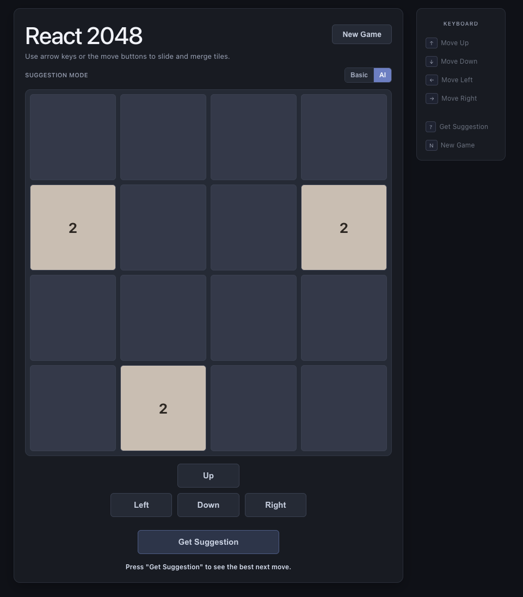

# React-2048

2048 game built with React and TypeScript, including keyboard controls, game-state detection, and offline AI move suggestions. (In reference to [play2048.co](https://play2048.co/classic))




## Tech Stack

- React
- TypeScript
- Vite
- Vitest

## Getting Started

### Requirements

| Tool | Version |
|------|---------|
| Node.js | >=20.19.0 (LTS lines 20, 22, and 24 all work) |
| npm | >=10.0.0 |

> **These are enforced.** Running `npm install` with an older version will print a clear error and exit before installing anything.

---

### Step 1 — Get the right Node.js version

If you use [nvm](https://github.com/nvm-sh/nvm) (recommended), the repo ships a `.nvmrc` file so you can switch with a single command:

```bash
nvm install   # downloads the pinned version if you don't have it yet
nvm use       # switches to it for this session
```

Verify you are on a compatible version:

```bash
node -v   # should be v20.19.0 or newer
npm -v    # should be 10.0.0 or newer
```

If you don't use nvm, download Node.js directly from [nodejs.org](https://nodejs.org). Any current LTS release (20, 22, or 24) works.

---

### Step 2 — Clone the repository

```bash
git clone https://github.com/yessur3808/react-2048.git
cd react-2048
```

---

### Step 3 — Install dependencies

```bash
npm install
```

The preinstall script checks your Node.js and npm versions automatically. If they don't meet the minimum requirements, the install will stop with a message explaining what to fix.

---

### Step 4 — Start the development server

```bash
npm run dev
```

Open the URL printed in your terminal — usually `http://localhost:5173` — in any modern browser.

> **Hot reload is enabled.** Any file you edit will update the browser instantly without a full page refresh.

---

### Step 5 — Run the tests

Run the full test suite once:

```bash
npm run test:run
```

Run tests in watch mode (re-runs on every file save, useful while developing):

```bash
npm test
```

---

### Step 6 — Build for production

Compile TypeScript and bundle the app into the `dist/` folder:

```bash
npm run build
```

Preview the production build locally before deploying:

```bash
npm run preview
```

---

### Available scripts at a glance

| Command | What it does |
|---------|-------------|
| `npm run dev` | Start local dev server with hot reload |
| `npm run build` | Type-check and bundle for production |
| `npm run preview` | Serve the production build locally |
| `npm run lint` | Run ESLint across the whole project |
| `npm run test` | Run tests in interactive watch mode |
| `npm run test:run` | Run tests once and exit |

## AI Model Prerequisites

Offline AI suggestions require local model files at:

- `public/models/2048/model.json`
- `public/models/2048/*.bin`

If these files are missing, the game still runs normally, but AI suggestions will not be available. See `public/models/2048/README.md` for model format details.

## Features

- 4x4 2048 board
- Randomized initial board setup
- Left / right / up / down movement
- Adds a new `2` or `4` after valid moves
- Win detection (reaching 2048)
- Loss detection (no legal moves remaining)
- Keyboard controls
- Offline AI move suggestion

## AI Move Suggestion

The project includes two local suggestion strategies:

- **Basic heuristic suggestion** (old fashioned)
- **Offline AI model suggestion (TensorFlow.js)**

### Brief explanation of the AI heuristic

The basic heuristic evaluates each possible move and scores the resulting board using a weighted combination of:

- Number of empty cells (more space is better)
- Number of merge opportunities (adjacent equal tiles)
- Value of the highest tile
- Bonus if the highest tile is kept in a corner
- Large penalty if the board becomes immobile

The move with the highest score is suggested.

### Offline AI model

In AI mode, the app loads a local TensorFlow.js model from `public/models/2048/model.json` and predicts directional scores for `left`, `up`, `right`, and `down`. The app then picks the highest-scoring **legal** move.

No external AI API calls or credentials are required.